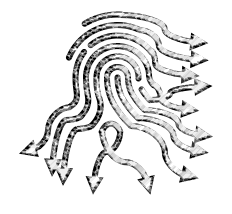

# ShiftingBrowserFingerprints

<p align="center">
  
</p>

## About
A package for web scraper code to utilise fingerprint obfuscation techniques against browser fingerprinting software in Firefox when web scraping from a pre-defined page.
Various browser fingerprinting obfuscation techniques that can be called, with any combination, include:
* Audio
* Battery
* Canvas
* ClientRects
* Font
* Screen
* Navigator
* WebGL
* WebRTC

By following this method of stacking techniques, we can increase our coverage against browser 
fingerprinting techniques.


## Example Usage
First install the package:
```
pip install -v git+https://github.com/PeterAFockema/ShiftingBrowserFingerprints
```

We run the following code in Python 3.
Locally generate the API extensions/ Addons that will be utilised for fingerprint obfuscation.
```
from shiftingbrowserfingerprints.generate_xpis import build_all_unsigned_xpi_extensions

build_all_unsigned_xpi_extensions()
```

To scrape from the desired web page, run the following as a Python script:

```
from shiftingbrowserfingerprints.firefox_scrapers import FirefoxScrapers as Scrapers

scrapers = Scrapers()
driver = scrapers.firefox_driver_extension_list_implementation(passed_value)

# Navigate to the user-defined page
url = "<INSERT URL ADDRESS HERE>"

driver.get(url)
```