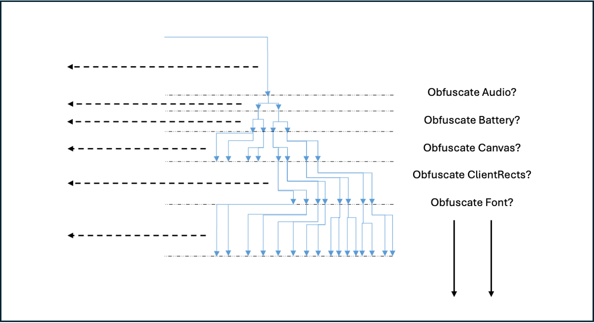
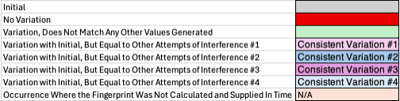
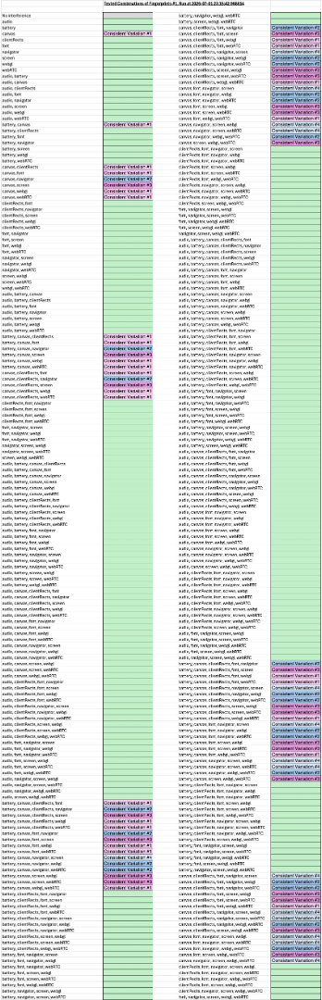

# Summary

Browser fingerprinting (also known as device or online fingerprinting) is a family 
of techniques that is utilised on the majority of the top 1000 websites (in 
terms of traffic used online). The fingerprinting software used by these types of
websites has increased in resilience to methods of obfuscation of their calculated
results of visitor ids (the final calculation of a fingerprint id).

The fingerprinting introduced by these websites are often used to target users for
advertising or to identify repeat users visiting websites which can be flagged 
as web scrapers.

The ability to 'dupe' browser fingerprinting therefore has value to users that 
want to repeatedly pull page data from specific websites without maintaining a 
singular fingerprint that can be used to track their activity across the website
and, if the fingerprints are shared with 3rd parties, across multiple websites.
This can reduce the user's susceptibility to unwanted marketing or profiling by
employers of fingerprint tracking.

The field of fingerprinting, which aims to identify users on a website and 
assign them a vistor id to track their activities or interests is now 
well-established and, as mentioned above, commonly used, so a software tool that 
can help obfuscate the replicability of the visitor id calculated when a visitor 
accesses a website using browser fingerprinting is of increasing interest.

# Statement of need

We can first consider how browser fingerprinting is applied, where the website the
user visits will run a script when the site is accessed, typically as JavaScript
in the browser [@Fingerprint:2026; @FingerprintJS:2026]. The purpose here is to 
collect and store particular information about the computer being used [@Hibbert:2022]. 

The information collected can include the Operating System (e.g. whether the visitor 
uses a Windows machine, or a Linux variety), the browser in question (e.g. Firefox, 
Chrome, Edge, or IceWeasel), the language in use (e.g. English, French), screen 
resolution, font size, etc. Various techniques have been created to collect and use these 
types of data to calculate a reasonably accurate unique identifier for a site visitor.

Whilst some individual fingerprinting techniques can provide more unique 
identifiers than others ( e.g. canvas fingerprinting is touted as having, 
depending on the source, between 80% and 99% accuracy [@Ganz:2024]), if they are 
combined with other fingerprinting techniques then there can be a 99.99+% 
accuracy. [@Omisola:2025] 
The result is that when fingerprinting uses a collection of techniques it can 
become highly accurate (where only 1 in 286777 browsers share the same fingerprint 
with other users on the internet [@Eckersley:2010]).

Browser fingerprinting usage has increased at a significant rate in the last 
decade, where fingerprinting occurred on less than 1% of the 10000 most visited 
websites in 2013, yet by 2021 a quarter were employing browser fingerprinting 
techniques. [@IBM:2023]

`FingerprintObfuscation` was designed for stress-testing fingerprinting software 
against chosen obfuscation techniques and was developed as a fingerprinting-
interference Python package that can call these techniques to interfere with 
active browser fingerprinting against a user that is implementing browser scraping via 
a set Python script.

# State of the field                                                                                                                  

Several tools exist for browser fingerprint obfuscation, typically in the form of 
browser extensions/ add-ons for Chrome or Firefox. These include, but are not limited 
to:

* AudioContext Scrambler [@Sayrus:2020]
* CanvasBlocker [@kkapsner:2026]
* Font Fingerprint Defender [@ilGur1:2026] 
* WebGL Fingerprint Defender [@ilGur2:2026]
* Fingerprint Defender [@digitalfracture:2026]

Tools like these maintain many of the capabilities we want to implement, however
they are only implemented as browser add-ons and require implementation via the browser 
(so lack the integration into a Python package or the ability to add or remove based on
dynamic user preferences).

With regards to python packages that have similar goals, there are the

The primary existing tools that 'dupe' fingerprinting techniques exist primarily as 
browser add-ons supplied through platforms such as Mozilla and Chrome.
           

`FingerprintObfuscation` was built rather than contributing to existing projects for 
multiple reasons. First, `FingerprintObfuscation` was designed from the ground up to 
integrate in a web scraping architecture, by calling and instantiating web drivers 
on behalf of the user. Through `FingerprintObfuscation` we can supply different 
configurations of the web drivers for the user to run against a defined web URL 
endpoint to scrape data from whilst with fingerprint obfuscation techniques (of the 
user's choice) switched on.

This integration between fingerprint obfuscation through use of a Python package
fills a specific niche between simple demonstration and full codes for web-scraping 
software and fingerprint obfuscation through browser add-ons that would usually be 
added by the user, often through the web interface. This allows the user to maintain
performance through automation and usability through the `FingerprintObfuscation` 
interface.

# Software design

`FingerprintObfuscation` is a Python package which is designed with the following 
core principles in mind:
(1) Provide a user-friendly, modular, object-oriented API
(2) Use community tools and standards (PEP8 coding standards)
(3) Maximum control for the user to call obfuscation techniques of choice
The package supplies the obfuscation methods for the following fingerprinting 
techniques:
* Audio
* Battery
* Canvas
* ClientRects
* Font
* Navigator
* Screen
* WebGL
* WebRTC

By combining these techniques we can observe the effects as they are layered
and applied to the user's browser as Addons. This package currently only supports
the Firefox browser. These Addons can be called indivually for the purposes of web
scraping or used in conjunction with each other.

(4) Package instantiation on command
The user will build the Addon/ Extension files that the package 
dynamically calls to install on the Firefox browser driver. The extensions are
unsigned by design for ease of creation by the end user and as a double lock so 
they will not persist on the browser after the end of a browser session.

`FingerprintObfuscation` should be called by a program implemented using Python for 
scraping a set website and is designed to not impact the purpose of the underlying 
program. 

The API for `FingerprintObfuscation` is designed to provide a class-based and user-
friendly interface to fast implementations of various browser fingerprinting 
obfuscation technique implementations in a dynamic manner.

# Research impact statement

`FingerprintObfuscation` has demonstrated a research impact on how to counter 
known fingerprinting techniques employed by major fingerprinting vendors, like 
FingerprintJS [@Fingerprint:2026; @FingerprintJS:2026]. 

`FingerprintObfuscation` started as a tool to support the experimentation of 
how combining multiple techniques together to dupe a combination of at least 
the techniques defined in the `Software Design` section.

We saw that successively combining these techniques produced increased variance 
in the final fingerprint id/ visitor id. 

The result was that combining these techniques could produce complete variation 
in the fingerprint visitor id produced by software like FingerprintJS 
[@Fingerprint:2026; @FingerprintJS:2026].that is a widespread fingerprinting 
vendor that combines a number of fingeprinting techniques to generate a 
fingerprint, represented by it's visitor_id variable.

We have run the software using the defined testing framework at
[browser_fingerprinting_test_framework:2026]

If we consider the following representation of the results:  
  
Where grey represents the initial fingerprint for the run (which a remained consistent value 
throughout all three runs), red represents a run with no variation away from the original 
fingerprint, and green represents a successful variation away the original fingerprint, we have 
the following:  

Notable behaviour can be observed in relation to the canvas fingerprinting interference results.
We can observe canvas interference results in the following table.   
  
Here, we see that while the canvas fingerprint obfuscation techniques result in a variation in 
the fingerprint away from the initial fingerprint calculated (when no Addons were implemented to 
add interference), they produce a set of consistent fingerprints even when combined with other 
fingerprint obfuscation techniques.
These are where the fingerprint id calculated to Variation 1 is observed for the canvas obfuscation
technique applied either on its own, or in conjuction with one or more of the following:

* [battery, clientRects, font, webgl, webRTC]

For the resultant fingerprint id, we receive Variation 2 if we apply canvas interference 
stacked with navigator interference. These two interference/ obfuscation techniques can be 
combined with the following obfuscation techniques to consistently receive the Variation 2 of a 
fingerprint id.

The canvas obfuscation script enerates random mathematical noise to actively alter graphic pixels 
so that the website visit results in a unique canvas signature whilst the navigator script disables 
spoofing and overwrites `navigator.plugins` to return an empty array [] as part of a blending approach
to make the values generic. The consistent value implemented by the navigator script is sufficient 
for the FingerprintJS to be considered a consistent visitor (when in conjunction with the canvas obfuscation).

* [battery, clientRects, font, webgl, webRTC]

For the resultant fingerprint id, we receive Variation 3 if we apply canvas interference 
stacked with screen interference. These two interference/ obfuscation techniques can be 
combined with the following obfuscation techniques to consistently receive the Variation 3 of a 
fingerprint id.

* [battery, clientRects, font, webgl, webRTC]

The screen interference technique employeed uses a crowd blending approach to force a hardcoded and highly 
common configuration (1920x1080 resolution, 24-bit color depth). This is so your browser profile 
looks exactly like millions of other standard desktop users. Again, we see that the hardcoded values
provide consistency of calculated response when a tool such as FingerprintJS is responding to 
canvas fingerprinting obfuscation.

For the resultant fingerprint id, we receive Variation 4 if we apply canvas interference 
stacked with both navigator and screen interference. These three interference/ obfuscation 
techniques can be combined with the following obfuscation techniques to consistently receive the 
Variation 4 of a fingerprint id.

* [battery, clientRects, font, webgl, webRTC]

The exception to these rules applies to canvas fingerprinting obfuscation when combined with audio 
fingerprinting interference where the technique implemented for the audio fingerprinting 
obfuscation interferes with the Fingerprinting software within the browser (using FingerprintJS)
to calculate a visitor id/ fingerprint that is unique on each browser session.

The difference between these obfuscation techniques is that the Audio only hooks into AudioContext 
and OfflineAudioContext to protect against audio-based tracking. The canvas obfuscation hooks into 
HTMLCanvasElement and CanvasRenderingContext2D to protect against graphic-rendering tracking.
The audio script adds fine-grain floating-point noise (-0.0001 to 0.0001) and byte noise (-1 to 1) 
to audio frequencies and waveforms whilst the canvas script manipulates the img.data[i] of rendered 
canvas pixels. This demonstrates that the FingerprintJS fingeprinting techniques are more resilient
to canvas fingerprinting interference but less so to audio interference, although their fingerprint
calculations can be heavily affected by noise added to audi frequencies.

With regards to the following obfuscation techniques (presented below) that did not affect the 
outcome of the canvas fingerprinting obfuscation technique either on its own or combined/ stacked 
with navigator or screen fingerprint obfuscation techniques.

* [battery, clientRects, font, webgl, webRTC]

Each of these techniques produce a reliable randomness for the fingerprint id (as calculated by the
FingerprintJS opensource software), where repeated runs of each produce a different fingerprint id 
per browser session.

It is worth noting that navigator and screen obfuscation techniques, when not combined with our canvas 
obfuscation technique, also produce reliably distinct fingerprint ids for each browser session.

# AI usage disclosure

No generative AI tools were used in the development of this software, the writing
of this manuscript, or the preparation of supporting materials.

# Acknowledgements

We express our gratitude to Infoserv Systems for their ongoing encouragement.